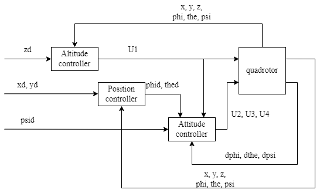
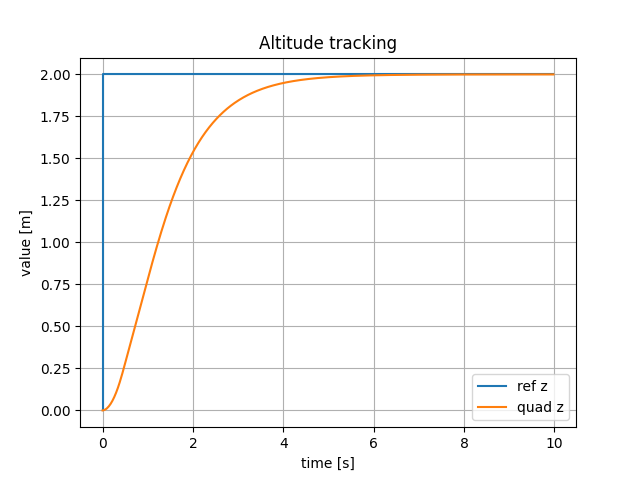
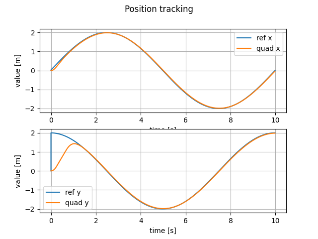
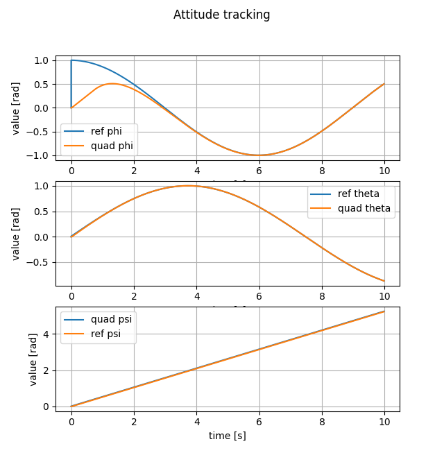
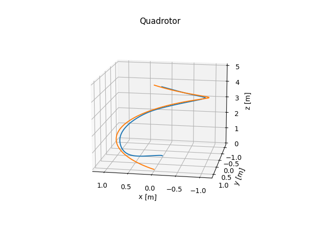
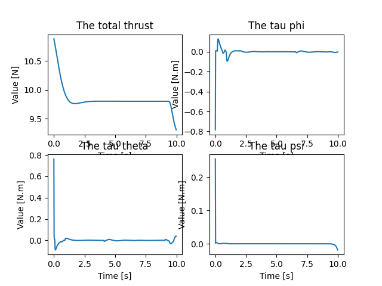

# The MPC tracking for quadrotor

The controller for quadrotor tracking are include 3 subcontrollers. They are Altititude controller , Position controller and Attitude controller. The detail of them are shown in the Figure below.

The MPC solver is using [CasADi](https://web.casadi.org/).
## The tracking of each controller
Implement 3 MPC controller without relation

### The altitude tracking

### The position tracking

### The attitude tracking

## The quadrotor tracking

## Todo

* Implement LNMPC controller for stable behavior